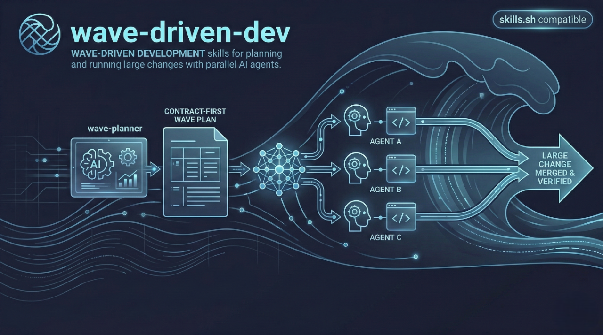
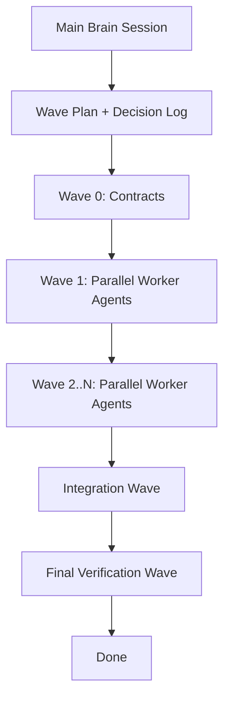

# wave-driven-dev

Wave-Driven Development for modern coding agents: plan once, execute in waves, parallelize safely, and integrate with control.

Tags: `wave-driven-development` `multi-agent` `acpx` `codex` `claude-code` `gemini` `openrouter` `pi` `planning` `orchestration`

Suggested GitHub About text:
`Wave-Driven Development skills for coding agents: contract-first planning, parallel wave execution, and controlled integration with acpx.`



`wave-driven-dev` provides two skills:
- `wave-planner`: builds a contract-first Wave Plan (Wave 0 -> Wave N -> Integration -> Final Verification)
- `acpx`: runs and controls multi-session agent execution with `acpx` CLI

## Requirements

You need at least one coding agent CLI available in your environment.

Examples:
- Codex
- Claude Code
- Gemini
- OpenRouter
- Pi

You also need `acpx`, because Wave-Driven execution uses headless agent sessions from terminal workflows.

Install `acpx`:

```bash
npm install -g acpx@latest
```

Learn more / install from source:
- [acpx GitHub](https://github.com/openclaw/acpx)

## Install Skills

From your project directory, run:

```bash
npx skills add https://github.com/Asm3r96/wave-driven-dev
```

This uses [skills.sh](https://skills.sh/) and will auto-detect available skills, then ask whether to install to project or global scope.

## Why Wave-Driven Dev?

Traditional workflow often means one long session with one agent handling everything end-to-end. That usually causes:
- overloaded context windows
- slower iteration
- weak separation of concerns
- more merge conflicts when tasks are broad

Wave-Driven Dev changes this model:
- Use a strong "main brain" session to define the plan and architecture.
- Split implementation into waves of isolated tasks.
- Run multiple worker agents in parallel per wave.
- Keep each worker narrowly scoped (files + tests + expected output).
- Integrate only after each wave completes.

Result: better throughput, cleaner ownership, smaller contexts per agent, and safer integration.

### Why not just use built-in subagents in a single CLI (for example Claude Code)?

Built-in subagents are useful, but they are usually scoped to their own ecosystem. In practice, that means subagents in one CLI typically run models/tools from that same CLI stack.

Wave-Driven Dev is different because it relies on `acpx` as a headless orchestration layer. That lets the Main Brain run workers across different agent CLIs in one coordinated plan, for example:
- Codex for architecture-heavy reasoning
- Claude Code for complex implementation tasks
- Gemini or OpenRouter for smaller, strict, bounded tasks

So instead of being limited to one CLI's subagent system, you can choose the best agent per wave and per task while still keeping one consistent execution method.

## Method Overview

### Roles

- Main Brain: plans, defines contracts, integrates, verifies.
- Worker Agents: execute scoped tasks, return standardized handoffs.

### Wave sequence

1. Wave 0 (contracts first)
2. Wave 1..N (parallel implementation)
3. Integration Wave
4. Final Verification Wave



## Operational Pattern

1. Main Brain creates the full Wave Plan.
2. Main Brain generates worker prompts for each wave.
3. `acpx` runs worker sessions in parallel (named sessions).
4. Workers return standardized handoffs.
5. Main Brain merges in order, resolves integration issues, runs final checks.

## Skill List

- `wave-planner`
  - Produces Vision, Decision Log, Wave 0 Contracts, implementation waves, integration, and verification.
- `acpx`
  - Provides command patterns for headless prompt/exec/sessions workflows, queueing, and structured outputs.

## Quickstart

1. Install `acpx`:

```bash
npm install -g acpx@latest
```

2. Install skills into your current project or globally (interactive):

```bash
npx skills add https://github.com/Asm3r96/wave-driven-dev
```

3. Start with `wave-planner` to generate your plan.
4. Approve the plan.
5. Use `acpx` to execute worker sessions wave-by-wave.
6. Complete integration and final verification before merge.

## Repo Layout

```text
skills/
  wave-planner/
    SKILL.md
    templates/
  acpx/
    SKILL.md
    templates/
examples/
  sample-wave-plan.md
assets/
  wave-driven-dev-banner.png
```

## Versioning and Releases

This repo uses semantic versioning with a GitHub Actions release workflow.

- Current version is tracked in `VERSION`
- Release history is tracked in `CHANGELOG.md`
- Tags use `vX.Y.Z` format

Release behavior:
- Every push to `main` creates a `patch` release automatically (`X.Y.Z -> X.Y.(Z+1)`).
- Manual runs are still available for `minor` and `major` bumps from GitHub Actions -> `Release` -> `Run workflow`.

The workflow will:
- bump `VERSION`
- prepend a new entry in `CHANGELOG.md`
- commit changes to `main`
- create and push a git tag
- publish a GitHub Release

## Contributing

Contributions are welcome.

- Start with [CONTRIBUTING.md](./CONTRIBUTING.md)
- Please follow [CODE_OF_CONDUCT.md](./CODE_OF_CONDUCT.md)
- For security issues, use [SECURITY.md](./SECURITY.md)

## License

MIT. See [LICENSE](./LICENSE).
